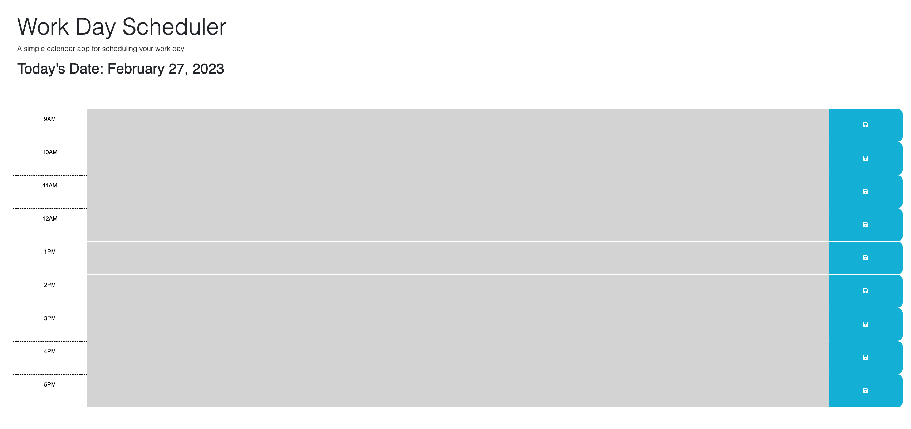

# Working-DayCal

### Description
This repo is for the UCLA fullstack program bootcamp, module 5.  
This program allows users to assign themselves task by the typical work day hour 
It does this by locally saving user inputs and then applying them on page reload 
Additionally the page tracks the date, and the time via color coded hour blocks 
The module 5 assignment provides the following as a guideline and criteria for the assignment:

### User Story
AS AN employee with a busy schedule 
I WANT to add important events to a daily planner 
SO THAT I can manage my time effectively 

### Acceptance Criteria
GIVEN I am using a daily planner to create a schedule 
WHEN I open the planner 
THEN the current day is displayed at the top of the calendar 
WHEN I scroll down 
THEN I am presented with time blocks for standard business hours 
WHEN I view the time blocks for that day 
THEN each time block is color-coded to indicate whether it is in the past, present, or future 
WHEN I click into a time block 
THEN I can enter an event 
WHEN I click the save button for that time block 
THEN the text for that event is saved in local storage 
WHEN I refresh the page 
THEN the saved events persist 

### Links

Original Code Repo: https://github.com/coding-boot-camp/crispy-octo-meme  
Deployed Application: https://vulnusr.github.io/CSLockwood-M5-WorkingDayCal/

### Screenshot

### Contact

Github: VulnusR 
Gmail: Caleb.lockwood626@gmail.com, Vulnus.Regium@gmail.com
